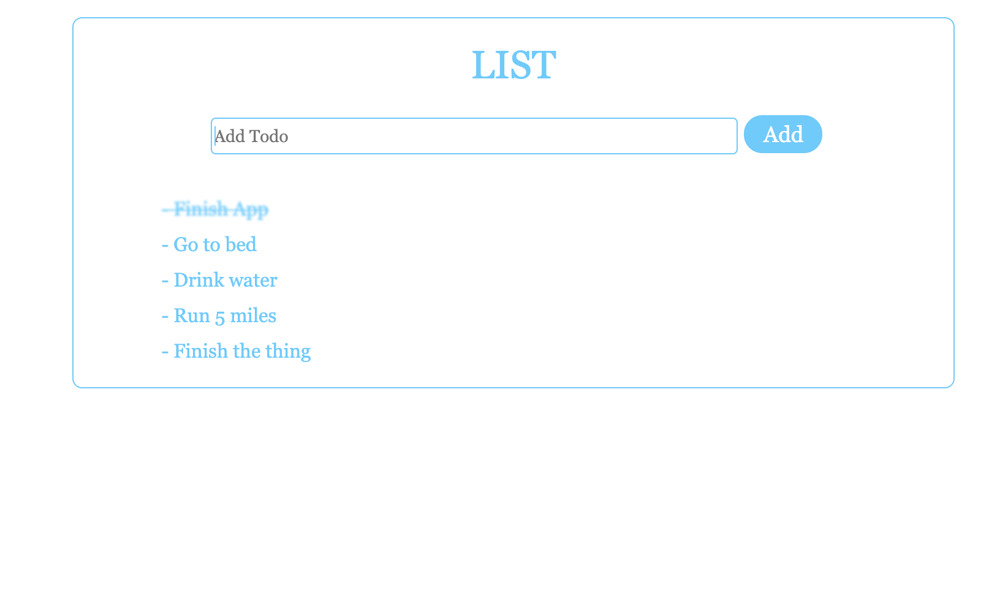
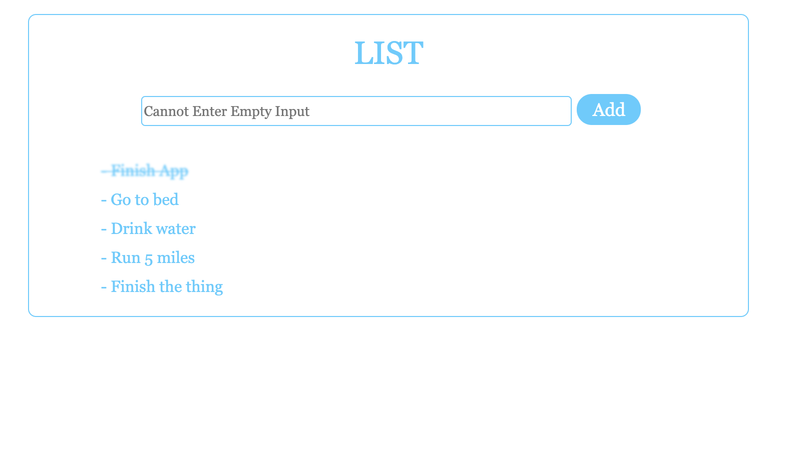
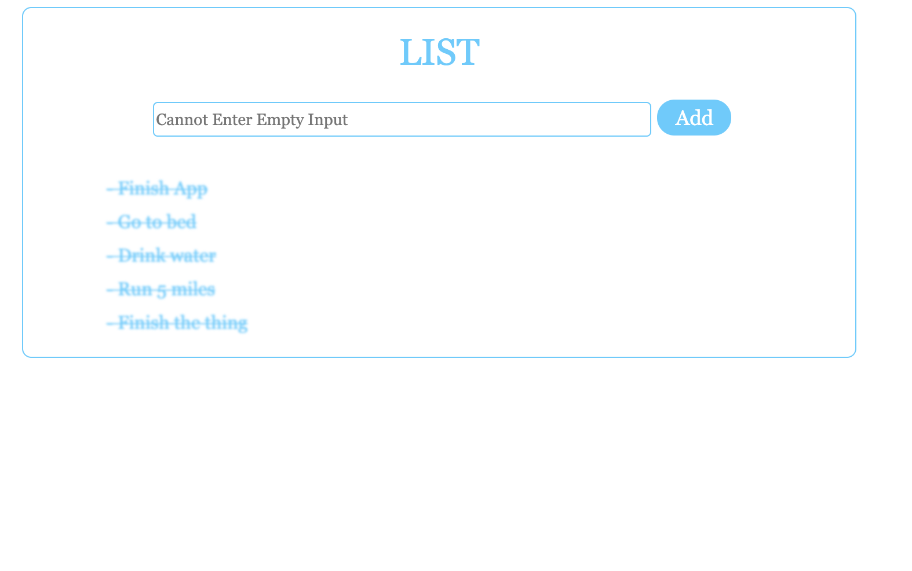

# react-simple-todo
Created with CodeSandbox

On arrival only the top two todos are present. I added three more todos. 

If the input is blank or cantains only blank spaces the 'placeholder' in the input will change, if you attempt to submit.

When click on the todo you can toggle from done (line-through and blured) to not done.

